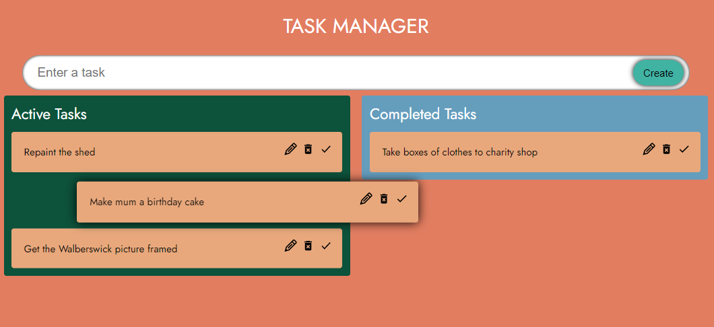
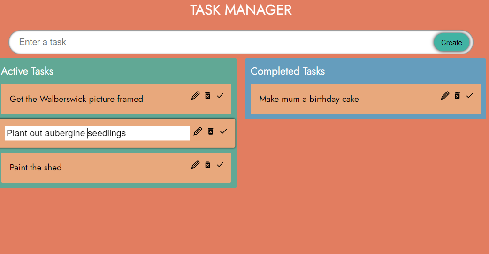

# Task Manager App

**React | TypeScript**

To learn the basics of TypeScript, and practice working with React, I built a simple frontend Task Manager web app, using the react-beautify-dnd for Draggable and Droppable.

## Features

- User can create a task
- User can drag and drop tasks, moving them between Active Tasks and Completed Tasks. When the task is in dragging state, it becomes focused and its source zone changes colour (using snapshot)
- User can edit and delete tasks

## To run the app

`npm start`

### Screenshots

